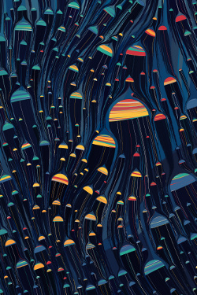

# genartlib



A Clojure library with simple utilities for creating generative artwork.

This library is built around [Quil](https://github.com/quil/quil), a Clojure wrapper around the [Processing](https://processing.org) framework. However, most of the functions are just mathematical utilies that could be used idependently.


To see and read about my artwork, visit [tylerxhobbs.com](https://tylerxhobbs.com) or follow me on [Instagram](https://instagram.com/tylerxhobbs) or [Twitter](https://twitter.com/tylerxhobbs).

## Usage

To install, add this to your dependencies in `project.clj`:

```clojure
[genartlib/genartlib "0.1.18"]
```

## Contents

The genartlib library has the following tools:

### Project Template

Under project-template/, you'll find the basic setup that I use for every new generative art project. This is geared towards creating static images.

I also wrote a bit about [my development setup and how I use it](https://tylerxhobbs.com/essays/2015/using-quil-for-artwork).

### Algebra

The following algebra-ish functions are defined:
* avg
* interpolate / interpolate-multi (linear interpolation)
* rescale (map from one range to another)
* line-intersection (find the intersection of two lines)
* lines-intersection-point (another way to find line intersections)
* slope / point-slope (get the slope of a line)
* y-intercept (get the y intercept point of a line)
* angle / point-angle (get the angle between two points in radians)
* angular-coords (calculate the offset location from a base point with angle and magnitude)
* point-dist (distance between two points)

### Geometry

* polygon-contains-point? (a fast test for checking if a point falls inside a polygon)
* rotate-polygon (rotates around the average center of the poly)
* shrink-polygon (shrink by a ratio)

### Curves

* chaikin-curve (a curve-smoothing algorithm)
* chaikin-curve-retain-ends (a variation that preserves the original end points)
* split-curve-by-step (break up a curve into chunks with the given length)
* split-curve-into-parts (break up a curve into chunks with equal length, given a number of parts to have)

### Random

* gauss (sample a gaussian probability distribution)
* abs-gauss (basically gauss + abs)
* triangular (sample a triangular probability distribution)
* pareto-sampler / pareto-sample (sample a pareto probability distribution)
* random-point-in-circle (uniform sampling of points within a circle)
* odds (returns true or false with the given probability)
* choice (pick from a list of items with uniform probability)
* weighted-choice (pick from a list of items, each with an assigned probability)
* repeatable-shuffle (a version of shuffle that uses Processing's Random, in order to ensure repeatability with the same seed)

### Utils

* w and h (shorthand for expressing a length or position in terms of percentage of the image width or height - good for using a pseudo-vector approach to creating images)
* set-color-mode (set the color mode to HSV with ranges H [0, 360], S [0.0, 100.0], V [0.0, 100.0], alpha [0.0, 1.0]
* in? / not-in? (test if a seq contains an item)
* between? (is a value inside an inclusive range?)
* enumerate (turns a seq of items into a seq like ([0 item-0] [1 item-1] [2 item-2] ...))
* zip (combine two or more seqs into tuples)
* snap-to (snap a value to a given window size, kind of like configurable rounding)
* vec-remove (remove an item from a vector)


## License

Copyright © Tyler Hobbs

Distributed under the MIT License.
